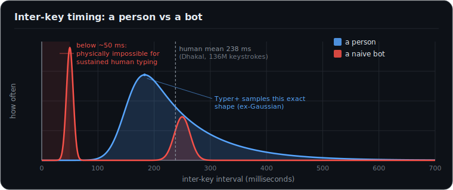
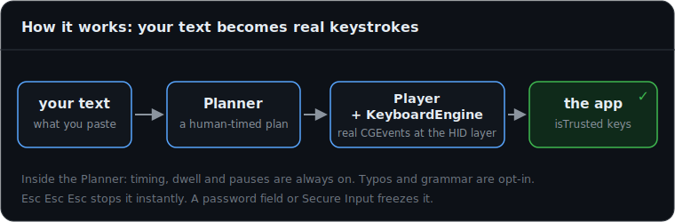

<div align="center">

# Typer+



**A macOS menu bar app that types your text the way a person would, one real keystroke at a time.**


</div>

Typer+ takes whatever text you give it and types it out, one real keystroke at a time, into whatever window is focused. By default it reproduces your text exactly, but the timing is entirely human: the speed drifts the way a real typist's does, common letter pairs come out a little faster, it holds each key for a human beat, it pauses at spaces and longer at sentence ends, and it warms up and tires out over a long passage.

Every character goes in through the macOS HID layer as a `CGEvent`, so the app you are typing into sees ordinary hardware keystrokes, the kind that report `isTrusted`. It reads your clipboard once to grab the text and otherwise leaves it alone. There is also an optional paste-delivery mode for editors that drop injected keys; it is off by default, and it is the one path that ever touches the clipboard.

> [!NOTE]
> This is a personal tool I wrote for my own machine. It synthesizes keyboard input and it listens for a stop gesture, so it has no business on a work-managed (MDM) Mac. There is an honest writeup of the design and how detectable it really is in [`RESEARCH.md`](RESEARCH.md). I tried not to oversell it.

## Why it looks human, not like a macro

A naive bot gives itself away on timing alone. It fires keys on a metronome, often faster than fingers can physically move, with almost no variation. A person never types like that. The gaps between your keystrokes are uneven, they skew toward the short side with a long tail of pauses, and they never drop below a physical floor.

<div align="center">

</div>

Typer+ draws every gap from the same shaped distribution real typists produce, an ex-Gaussian: a tight core with a long right tail. The numbers come straight from the keystroke-dynamics research (the anchor is Dhakal et al. 2018, 136 million keystrokes), and they are laid out in [`RESEARCH.md`](RESEARCH.md).

<div align="center">

</div>

All of that timing is on by default, and it is what the rhythm and the distribution above are really about. Turn on the human-errors layer in Settings and it goes a step further: it makes the occasional typo and goes back to fix it, adjacent-key slips, transpositions, doublings, sometimes corrected on the spot and sometimes a few characters later, the way you catch your own typo a beat too late, plus grammar and homophone slips it rereads and tidies at the end. The header animation up top is that layer in action. With reliable delivery switched off it will also let the next key start before the last one lifts, the way fast typists overlap.

## The four modes

| Mode | Feel | Speed |
|---|---|---|
| **Careful** | slow and deliberate | about 40 wpm |
| **Ultra Fast** | very quick, but it still pauses between words | about 230 wpm |
| **Max Speed** | deliberately superhuman, well past what a hand can do | about 800 wpm |
| **Max Stealth** | a natural typing rhythm, but paced on composition wall-clock time (extra thinking pauses, capped bursts, the odd false start) so an edit-history replay reads as written, not dumped | composition pace |

Reach for **Max Stealth** when a document's version history is the thing that matters. It is the only mode that paces the whole session like someone actually writing.

## How it works

Your text becomes a timed plan, then a player walks that plan and posts each key as a real event.

<div align="center">

</div>

## Build

You need the Swift toolchain on macOS 14 or newer. I built and tested it on macOS 26 on Apple Silicon.

```bash
./scripts/build_app.sh
open "$HOME/Desktop/Typer+.app"   # the script prints the real path
```

A keyboard icon shows up in your menu bar. Running `swift build` on its own only gives you the bare binary. The menu bar item and the global hotkey only work from the assembled `.app` bundle, which is what the script builds.

### Run the de-risk test first

The whole thing rests on two assumptions: that the browser treats the injected keystrokes as real input, and that the target field actually takes them. Before you trust the full app, prove both:

```bash
swift run InjectTest
```

Then follow [`docs/test-instructions.md`](docs/test-instructions.md).

### The headless self test

```bash
swift run TyperPlus --selftest
```

This checks that the planner reproduces your text exactly, that every correction fully undoes the slip it introduced, and that the timing numbers land where the research says they should.

## First run and permissions

macOS will ask for permission, and the app deep links you straight to the right pane:

**System Settings, Privacy and Security, Accessibility**, then turn on **Typer+**.

That single grant covers posting keystrokes and watching for the stop gesture. If the menu says it needs permission or that the kill switch is unavailable, finish the grant and relaunch. To make the grant survive rebuilds instead of resetting each time, sign with a stable identity. The how-to is at the top of [`scripts/build_app.sh`](scripts/build_app.sh).

## Using it

1. Copy or write the text you want typed.
2. Click the menu bar icon, choose **Type pasted text**, paste your text, pick a mode, and hit **Type this**. Or skip all that and press **Cmd+Option+T** to type whatever is already on your clipboard.
3. You get a short countdown. Use it to click into the field you want the text to land in. Typing starts when the countdown ends.

To stop, press **Esc three times fast**, or pick **Stop typing** from the menu. There is also a URL scheme for scripting: `open typerplus://clipboard` types the clipboard, `open typerplus://stop` stops.

## How it stays out of trouble

- **It types, it does not paste.** By default every character is its own real, individually timed keystroke. The optional paste mode for glitchy editors is the only exception, and it is off until you ask for it.
- **Triple Esc is a hard stop.** It runs on a separate self-healing global tap that has nothing to do with the typing engine, and Typer+ never injects an Esc itself, so the stop can never be confused for one of its own keystrokes.
- **It freezes during secure input.** While a password field or Secure Input is active it stops entirely and resumes when the field loses focus, so keys are never dropped and the stop gesture is never in doubt.

## How it is put together

| File | What it does |
|---|---|
| `Sources/TyperPlus/KeyboardEngine.swift` | posts keystrokes at the HID layer with CGEvent (and the optional Cmd+V paste path) |
| `Sources/TyperPlus/Planner.swift` | turns text into a timed list of actions, with the timing, and the opt-in typos and corrections |
| `Sources/TyperPlus/Timing.swift`, `TypingProfile.swift` | the timing model and the four mode presets |
| `Sources/TyperPlus/Typos.swift`, `TextCleanup.swift` | how mistakes get made and unmade, plus the homophone layer |
| `Sources/TyperPlus/Player.swift` | plays the plan back on the main thread, safe to pause or abort mid run |
| `Sources/TyperPlus/KillSwitch.swift` | the triple Esc stop, kept independent of the typing |
| `Sources/InjectTest/` | the de-risk harness |
| [`RESEARCH.md`](RESEARCH.md) | the research it is built on, and a straight account of its limits |

## License

[MIT](LICENSE). Copyright 2026 Ahmed Ufuk Serce. I wrote this for personal use. Whatever you do with it is on you, including staying on the right side of the terms of whatever you type into.
